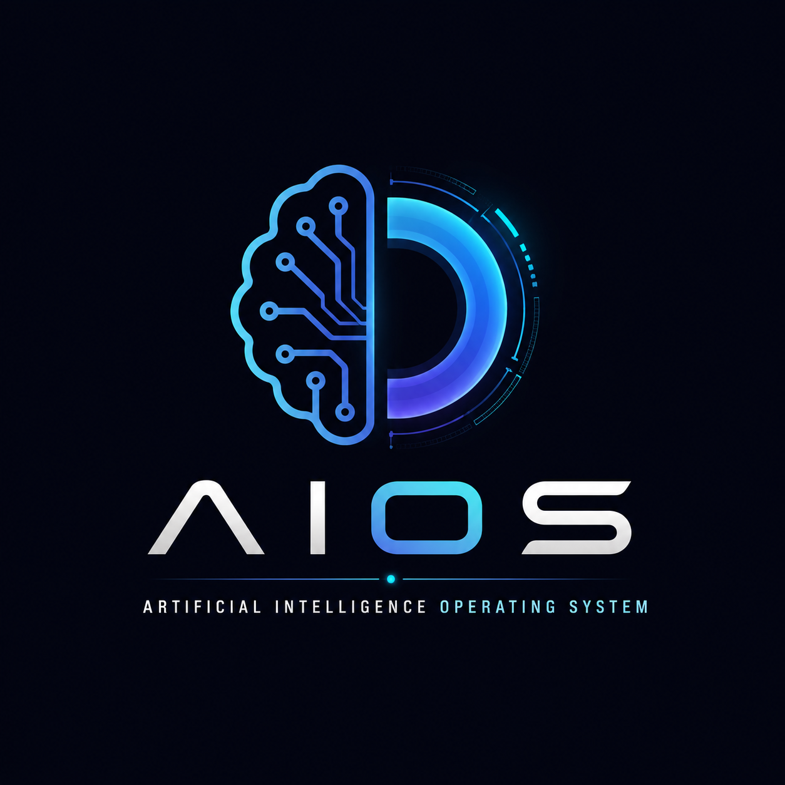

<p align="center">
  
</p>

<h1 align="center">AIOS</h1>

<p align="center">
<b>Artificial Intelligence Operating System</b>
</p>

<p align="center">
<b>Engineer the workspace, not the prompt.</b>
</p>

<p align="center">


</p>

---

# What is AIOS?

AIOS (Artificial Intelligence Operating System) is an open framework that transforms AI coding assistants into repository-aware engineering partners.

Instead of relying only on prompts, AIOS provides a structured working environment that teaches AI agents how to:

- understand an entire repository
- follow project conventions
- analyze before implementing
- detect conflicts
- respect coding standards
- review their own work
- collaborate as long-term project members

AIOS helps AI work like an experienced software engineer rather than a simple code generator.

---

# The Problem

Modern AI coding assistants are powerful.

However, they often:

- ignore repository conventions
- create inconsistent documentation
- duplicate implementations
- forget previous project decisions
- modify unrelated files
- skip important quality checks
- generate inconsistent notebook structures

The problem is usually not the AI itself.

The problem is the lack of project context.

---

# The AIOS Philosophy

> AI doesn't become better because of longer prompts.

> AI becomes better because of better context.

Instead of writing longer prompts,

design a better repository.

---

# Architecture

```text
                  User
                    │
                    ▼
               Repository
                    │
                    ▼
              AIOS Kernel
                    │
       ┌────────────┼────────────┐
       │            │            │
       ▼            ▼            ▼
   Workflow     Knowledge    Checklists
       │            │            │
       └────────────┼────────────┘
                    ▼
              AI Coding Agent
                    │
                    ▼
             High Quality Output
```

---

# Components

## AGENTS.md

Defines how the AI should behave.

---

## MANIFEST.md

Defines the project's philosophy and engineering principles.

---

## PROJECT_STRUCTURE.md

Explains the repository architecture.

---

## CHECKLISTS

Quality verification before implementation.

---

## WORKFLOWS

Step-by-step implementation processes.

---

## KNOWLEDGE

Repository-specific knowledge.

---

## SKILLS

Technology-specific best practices.

---

## TEMPLATES

Reusable project templates.

---

## TESTS

Behavior validation.

---

# Features

✅ Repository Intelligence

✅ Workflow Engine

✅ Repository Memory

✅ Approval Gates

✅ Conflict Detection

✅ Self Review

✅ Definition of Done

✅ Documentation Standards

✅ Educational Standards

✅ Repository Safety

---

# Quick Start

Clone the repository.

```bash
git clone https://github.com/YOUR_USERNAME/AIOS.git
```

Copy the AIOS core files into your project.

```
AGENTS.md

MANIFEST.md

PROJECT_RULES.md

STYLE_GUIDE.md

CHECKLISTS/

WORKFLOWS/
```

Then tell your AI assistant:

```
Read the entire repository.

Follow AIOS.

Analyze before implementing.

Wait for approval when required.
```

---

# AIOS Workflow

Traditional AI workflow

```text
Prompt

↓

AI

↓

Output
```

AIOS workflow

```text
Repository

↓

Rules

↓

Workflow

↓

Knowledge

↓

Decision

↓

Review

↓

Output
```

---

# Prompt Engineering vs AIOS

| Prompt Engineering | AIOS |
|--------------------|------|
| Better prompts | Better repositories |
| Temporary context | Persistent repository context |
| Conversation memory | Repository memory |
| User instructions | Engineering workflow |
| One task | Long-term collaboration |

---

# Validated Behaviors

AIOS has been successfully tested with real-world repositories.

✔ Repository Analysis

✔ Workflow Execution

✔ Repository Memory

✔ Approval Gates

✔ Conflict Detection

✔ Self Review

✔ Repository Rule Enforcement

---

# Example Projects

Projects currently using AIOS

- Python3_Kurs

More examples will be added soon.

---

# Roadmap

## Version 1.0

- AIOS Core
- Documentation
- AGENTS
- Manifest
- Project Structure

## Version 1.1

- Workflow Library
- Checklists
- Templates

## Version 2.0

- Knowledge System
- Skills
- Test Framework

---

# Contributing

Contributions are welcome.

Please open an issue before introducing major architectural changes.

Ideas for:

- Workflows
- Skills
- Checklists
- Templates
- Documentation

are always appreciated.

---

# License

MIT License

---

# Vision

AIOS is not another prompt collection.

It is an operating framework for AI-assisted software development.

Our mission is simple.

> Engineer the workspace, not the prompt.

---

<p align="center">

Made with ❤️ for the AI Engineering community.

</p>