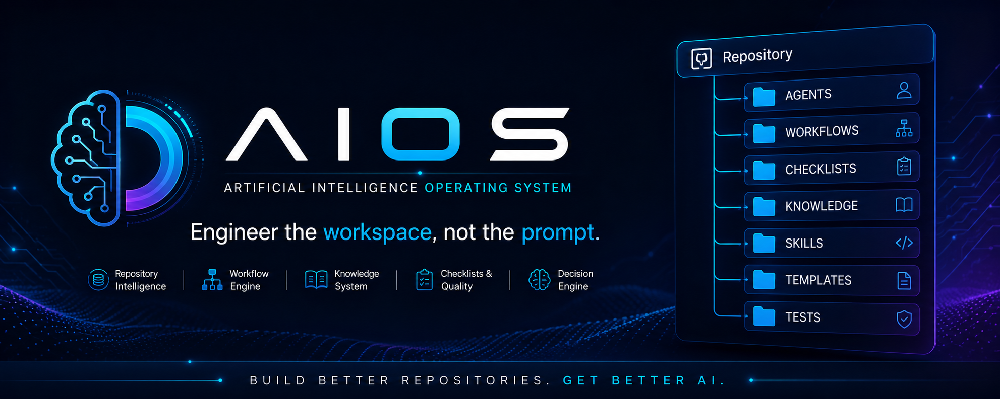
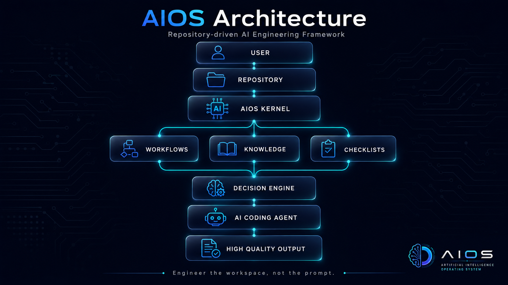
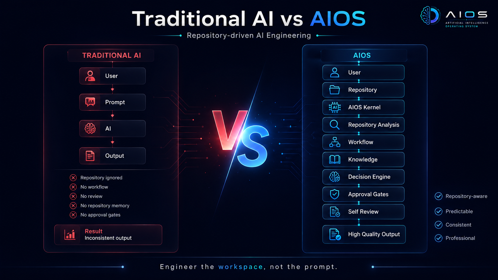
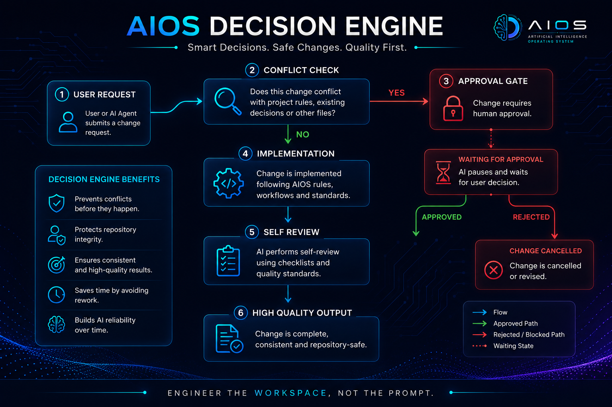
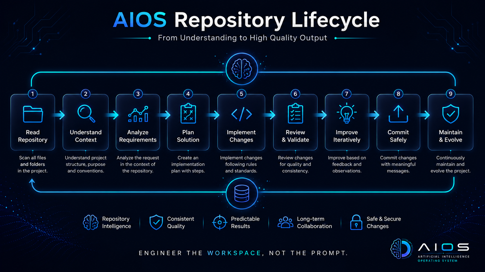

<p align="center">
  
</p>

<p align="center">


</p>

<p align="center">

**Repository-driven AI Engineering Framework**

*Engineer the workspace, not the prompt.*

</p>

---

# AIOS

AIOS (**Artificial Intelligence Operating System**) is an open framework that transforms AI coding assistants into **repository-aware engineering partners**.

Instead of relying solely on prompts, AIOS provides a structured engineering environment where AI agents learn how to understand repositories, follow project standards, respect workflows, detect conflicts, review their own work and collaborate consistently over time.

AIOS is designed for developers who believe that **better repositories create better AI.**

---

# Why AIOS?

Modern AI coding assistants are incredibly powerful.

Yet they often:

- ignore repository conventions
- forget previous project decisions
- create inconsistent documentation
- modify unrelated files
- skip quality checks
- duplicate existing implementations
- produce unpredictable results

The problem is rarely the AI.

The real problem is the **lack of persistent project context.**

AIOS solves this problem by moving knowledge from prompts into the repository itself.

---

# Philosophy

> AI doesn't become better because of longer prompts.

> AI becomes better because of better repositories.

Instead of teaching AI through conversation,

AIOS teaches AI through engineering.

---

# Architecture

<p align="center">

</p>

AIOS acts as the engineering layer between your repository and your AI coding assistant.

Rather than generating code immediately, AIOS encourages the agent to:

- understand
- analyze
- plan
- implement
- review
- document

before delivering a final result.

---

# Core Components

| Component | Purpose |
|------------|---------|
| **AGENTS.md** | Defines AI behavior and responsibilities |
| **MANIFEST.md** | Project philosophy and engineering principles |
| **PROJECT_STRUCTURE.md** | Repository architecture |
| **WORKFLOWS** | Step-by-step implementation processes |
| **CHECKLISTS** | Quality verification before implementation |
| **KNOWLEDGE** | Repository-specific knowledge |
| **SKILLS** | Technology-specific best practices |
| **TEMPLATES** | Reusable project templates |
| **TESTS** | AI behavior validation |

---

# AIOS Workflow

<p align="center">

</p>

Traditional AI focuses on prompts.

AIOS focuses on repositories.

This small shift fundamentally changes how AI collaborates with developers.

---

# Decision Engine

<p align="center">

</p>

Before implementing changes, AIOS evaluates:

- repository rules
- previous decisions
- workflow requirements
- approval gates
- quality standards

If a conflict exists, the AI stops and requests human approval instead of making unsafe assumptions.

---

# Repository Lifecycle

<p align="center">

</p>

AIOS follows a predictable engineering lifecycle:

1. Read the repository
2. Understand the project
3. Analyze the request
4. Create a plan
5. Implement changes
6. Review the result
7. Improve iteratively
8. Commit safely
9. Continuously evolve the repository

---

# Features

✅ Repository Intelligence

✅ Engineering Workflows

✅ Repository Memory

✅ Approval Gates

✅ Conflict Detection

✅ Self Review

✅ Definition of Done

✅ Documentation Standards

✅ Educational Standards

✅ Repository Safety

---

# Compatible With

AIOS is designed to work with modern AI coding assistants including:

- ChatGPT
- Codex
- Claude Code
- GitHub Copilot
- Cursor
- Windsurf
- Continue.dev
- Roo Code

---

# Quick Start

Clone the repository.

```bash
git clone https://github.com/fdeniz07/AIOS.git
```

Copy the AIOS core files into your project.

```text
AGENTS.md
MANIFEST.md
PROJECT_STRUCTURE.md

WORKFLOWS/
CHECKLISTS/
KNOWLEDGE/
```

Then simply tell your AI assistant:

```text
Read the entire repository.

Follow AGENTS.md.

Analyze before implementing.

Respect repository workflows.

Wait for approval when required.
```

---

# Validation

AIOS has already been successfully validated using real-world repositories.

Current validation includes:

- ✅ Educational Python Repository
- ✅ Notebook Generation
- ✅ Repository Analysis
- ✅ Workflow Execution
- ✅ Approval Gates
- ✅ Conflict Detection
- ✅ Self Review
- ✅ Repository Rule Enforcement

Additional validation projects will be added over time.

---

# Roadmap

## v1.0

- AIOS Core
- Documentation
- Architecture
- Workflow System

## v1.1

- Workflow Library
- Checklist Library
- Template Library

## v2.0

- Knowledge System
- Skills Library
- AI Test Framework
- Community Extensions

---

# Contributing

Contributions are always welcome.

We especially appreciate contributions related to:

- Engineering Workflows
- Skills
- Knowledge Libraries
- Templates
- Documentation
- Testing

Please open an Issue before introducing major architectural changes.

---

# License

Released under the MIT License.

---

# Vision

AIOS is not another prompt collection.

It is not another AI wrapper.

It is not another coding assistant.

AIOS is an engineering framework that helps AI become a reliable long-term software development partner.

---

<p align="center">

### Build better repositories.

# Get better AI.

</p>

---

<p align="center">
Made with ❤️ for the AI Engineering community.
</p>